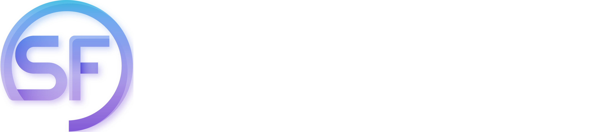
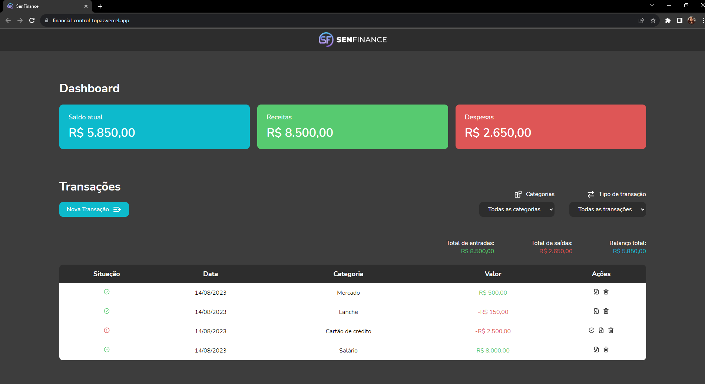

<a name="readme-top"></a>


<br />
<div align="center">
  <a href="https://github.com/brunnamattos/financial-control">
    
  </a>

  <h3 align="center">Application for personal financial control</h3>

  <p align="center">
    A business challenge project
    <br />
    <a href="https://github.com/brunnamattos/financial-control"><strong>Explore the docs »</strong></a>
    <br />
    <br />
    <a href="https://financial-control-topaz.vercel.app/">View Demo</a>
    ·
    <a href="https://github.com/brunnamattos/financial-control/issues">Report Bug</a>
    ·
    <a href="https://github.com/brunnamattos/financial-control/issues">Request Feature</a>
  </p>
</div>


<details>
  <summary>Table of Contents</summary>
  <ol>
    <li>
      <a href="#about-the-project">About The Project</a>
      <ul>
        <li><a href="#built-with">Built With</a></li>
      </ul>
    </li>
    <li>
      <a href="#getting-started">Getting Started</a>
      <ul>
        <li><a href="#prerequisites">Prerequisites</a></li>
        <li><a href="#installation">Installation</a></li>
      </ul>
    </li>
    <li><a href="#usage">Usage</a></li>
    <li><a href="#roadmap">Roadmap</a></li>
    <li><a href="#contributing">Contributing</a></li>
    <li><a href="#license">License</a></li>
    <li><a href="#contact">Contact</a></li>
    <li><a href="#acknowledgments">Acknowledgments</a></li>
  </ol>
</details>


## About The Project

<br />
<br />
<a href="https://github.com/brunnamattos/financial-control">
    
</a>
<br />
<br />
A project to help with your personal financial control. It has some features such as adding, editing and deleting financial transactions, which can be income or expenses, assigning to a category and defining whether the transaction is paid or received. In addition, there is an overall balance of all your transactions and another according to the selected filters.

<p align="right">(<a href="#readme-top">back to top</a>)</p>


### Built With

* [![React][React.js]][React-url]
* 
* 
* 

Libs:
* <a href="https://lucide.dev/">Lucide React<a>
* <a href="https://date-fns.org/">Date FNS<a>
* <a href="https://www.npmjs.com/package/react-uuid">UUID React<a>
* <a href="https://www.radix-ui.com/primitives/docs/components/dialog">Dialog React<a>

<p align="right">(<a href="#readme-top">back to top</a>)</p>


<!-- GETTING STARTED -->
## Getting Started

To get a local copy up and running follow these simple steps.

### Prerequisites

* npm
  ```sh
  npm install npm@latest -g
  ```

### Installation

1. Clone the repo
   ```sh
   git clone https://github.com/brunnamattos/financial-control.git
   ```
2. Install NPM packages
   ```sh
   npm install
   ```

<p align="right">(<a href="#readme-top">back to top</a>)</p>


## Roadmap

- [x] Layout - <a href="https://www.figma.com/file/X7EL4fReXUGcE7GVE98efC/SenFinance?type=design&node-id=14-318&mode=design&t=WmMsHkyWqUta2LkO-0">see on figma</a>
- [x] Add new transactions
- [x] Add types to transactions
- [x] Add categories to transactions
- [x] Save on localStorage
- [x] Table for viewing transactions
- [x] Area to view the total of all transactions
- [x] Filters
    - [x] Type filter
    - [x] Category
- [ ] Responsiveness
     


See the [open issues](https://github.com/brunnamattos/Best-README-Template/issues) for a full list of proposed features (and known issues).

<p align="right">(<a href="#readme-top">back to top</a>)</p>


<!-- CONTRIBUTING -->
## Contributing

Contributions are what make the open source community such an amazing place to learn, inspire, and create. Any contributions you make are **greatly appreciated**.

If you have a suggestion that would make this better, please fork the repo and create a pull request. You can also simply open an issue with the tag "enhancement".
Don't forget to give the project a star! Thanks again!

1. Fork the Project
2. Create your Feature Branch (`git checkout -b feature/AmazingFeature`)
3. Commit your Changes (`git commit -m 'Add some AmazingFeature'`)
4. Push to the Branch (`git push origin feature/AmazingFeature`)
5. Open a Pull Request

<p align="right">(<a href="#readme-top">back to top</a>)</p>


## Contact

Brunna Mattos - [Linkedin](https://www.linkedin.com/in/brunna-mattos/) - rjbrunna@outlook.com

Project Link: [Financial Control - SenFinance](https://github.com/brunnamattos/financial-control)

<p align="right">(<a href="#readme-top">back to top</a>)</p>


<!-- ACKNOWLEDGMENTS -->
## Acknowledgments

* A <a href="https://sensedata.com.br/">SenseData</a> challenge!

<p align="right">(<a href="#readme-top">back to top</a>)</p>


